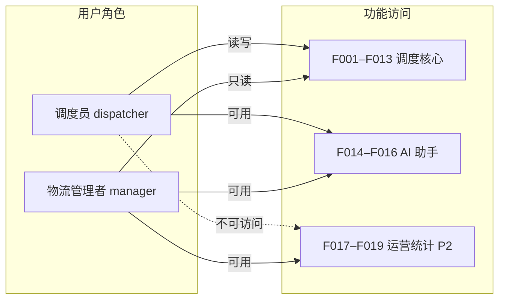
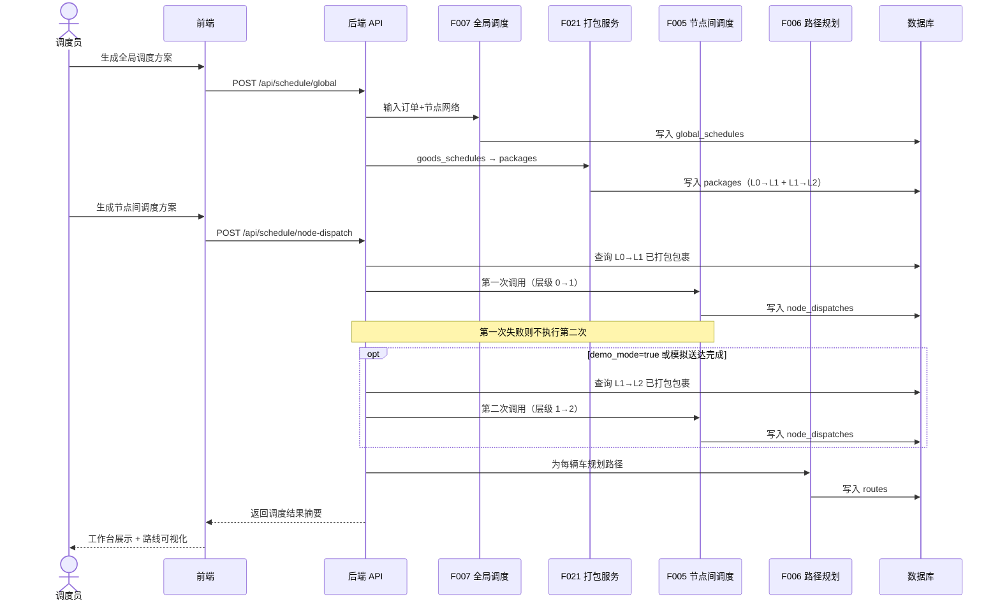
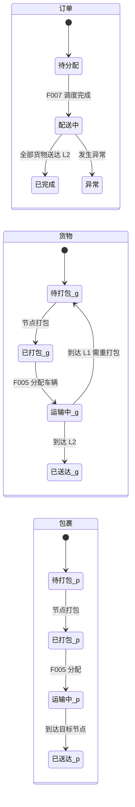
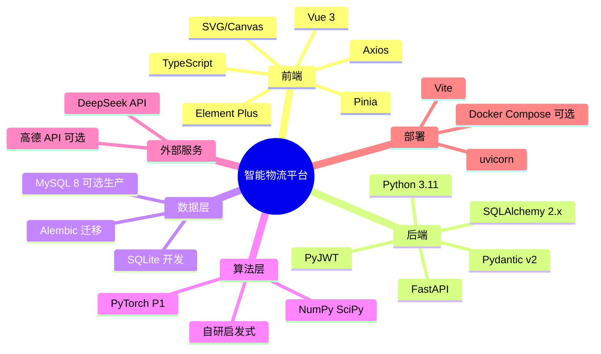
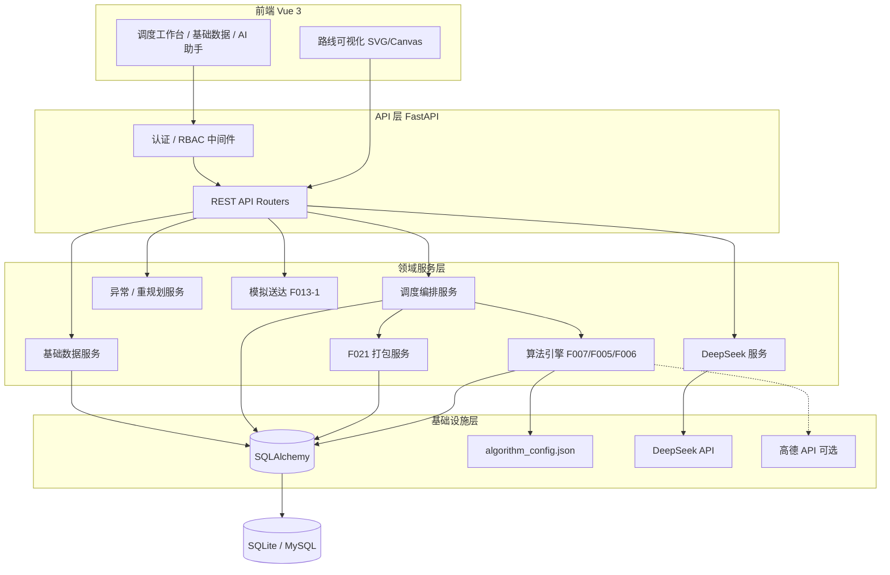
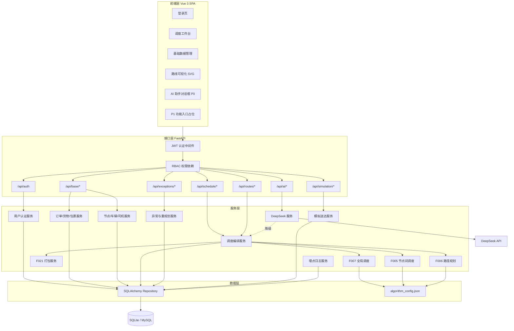
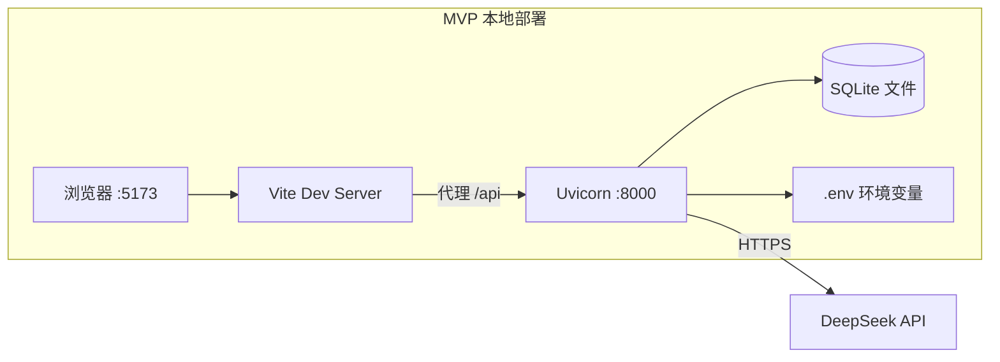
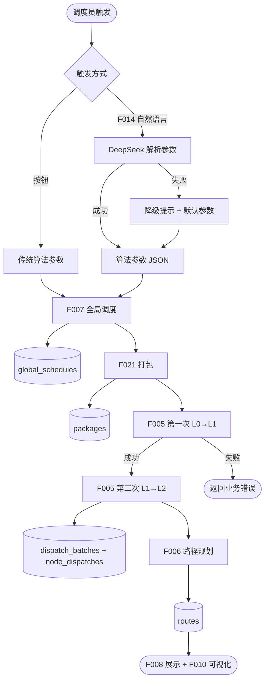
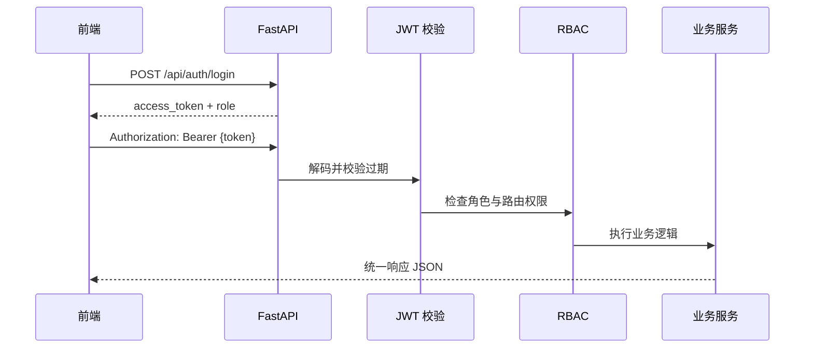
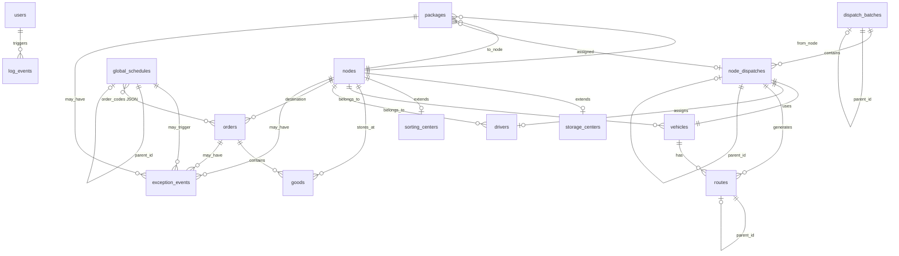

# DeepSeek 路径优化 - 智能物流平台 系统架构设计说明书

| 字段 | 值 |
| --- | --- |
| **项目名称** | DeepSeek 路径优化 - 智能物流平台 |
| **文档版本** | V1.0（MVP 架构设计） |
| **状态** | `Review — 待开发评审` |
| **作者** | System Designer 智能体 |
| **日期** | 2026-06-09 |
| **MVP 范围** | 仅 P0；P1/P2 保留扩展点 |
| **需求来源** | [03产品需求文档(PRD)-V2.7.md](../prds/03产品需求文档(PRD)-V2.7.md) |

> **文档阶段说明**
>
> 本文档按用户确认的工作流分阶段产出：
>
> | 阶段 | 内容 | 状态 |
> | --- | --- | --- |
> | **阶段一** | 需求分析 + 技术选型方案 | ✅ 已完成 |
> | **阶段二** | 系统架构设计 | ✅ 已完成 |
> | **阶段三** | 数据库设计（ER 图 + 核心表 DDL） | ✅ 已完成 |
> | **阶段四** | 接口规范设计 | ✅ 已完成 |
> | **阶段五** | 技术风险评估 + 架构评审打分 | ✅ 已完成 |

---

## 目录

1. [需求分析](#1-需求分析)
2. [待确认问题](#2-待确认问题)
3. [技术选型方案](#3-技术选型方案)
4. [系统架构设计](#4-系统架构设计)
5. [数据库设计](#5-数据库设计)
6. [接口规范设计](#6-接口规范设计)
7. [技术风险评估](#7-技术风险评估)
8. [架构评审打分](#8-架构评审打分)

---

## 1. 需求分析

### 1.1 产品定位与边界

| 维度 | 说明 |
| --- | --- |
| **项目性质** | 华中科技大学软件学院 2026 年 6 月教学实训项目，周期 4 周 |
| **核心目标** | 构建可演示的智能物流调度平台，形成「订单生成 → 全局调度 → 节点间调度 → 路径规划 → AI 解释与建议」完整业务闭环 |
| **质量定位** | 不追求生产级性能与高并发，要求业务流程完整、智能化能力可展示、技术架构可扩展 |
| **部署形态** | 本地运行演示为主，可选 Docker 一键启动 |

**系统边界（In Scope）**：

- 三级物流网络（存储中心 L0 → 1 级分拣中心 L1 → 0 级分拣中心 L2）的调度演示
- 基础数据 CRUD、批量导入、演示数据初始化
- 传统算法调度（P0）+ DeepSeek 自然语言编排（P0）
- 路线静态可视化（SVG/Canvas）、异常重规划演示
- 角色权限（调度员 / 物流管理者）

**系统边界（Out of Scope）**：

- 真实 ERP 对接、GPS 硬件、支付、短信通知
- 生产级集群部署、海量并发
- 交互式地图 API（架构预留）、多仓库数据隔离（V3.0）
- P2 运营统计（F017–F019）首期可不验收

### 1.2 用户角色与权限



| 角色 | 账号 | 登录后默认跳转 | 权限摘要 |
| --- | --- | --- | --- |
| 调度员 | `dispatcher` / `123456` | 调度工作台 | F001–F013 全部 P0 功能；F014 自然语言解析 |
| 物流管理者 | `manager` / `123456` | 调度工作台（只读） | F001–F013 只读；P2 运营看板本期不实现 |

认证方式：账号密码登录，Token 机制，过期时间 24 小时。

### 1.3 业务功能清单（按模块）

#### 模块 1：基础数据管理（P0）

| 功能 ID | 名称 | 优先级 | 核心能力 |
| --- | --- | --- | --- |
| F001 | 订单管理 | P0 | CRUD、Excel/CSV 批量导入、状态跟踪（待分配/配送中/已完成/异常） |
| F001-1 | 货物管理 | P0 | 货物实例建模，关联订单与存储中心，状态自动流转 |
| F001-2 | 包裹管理 | P0 | 查看、手动重新打包，运输单位管理 |
| F002 | 车辆管理 | P0 | 车辆信息维护，按节点归属，状态管理 |
| F003 | 司机管理 | P0 | 司机信息维护，按节点归属 |
| F004 | 存储中心管理 | P0 | 存储中心 CRUD，通过 `nodes` 统一节点表关联 |
| F004-1 | 分拣中心管理 | P0 | 1 级/0 级分拣中心，容量与最大存储时长 |

#### 模块 2：核心调度算法（P0/P1）

| 功能 ID | 名称 | 优先级 | 核心能力 |
| --- | --- | --- | --- |
| F007 | 全局调度 | P0 | 规则评分 + 启发式，为每票货物规划 L0→L1→L2 路径 |
| F021 | 货物打包服务 | P0 | F007 完成后自动生成 L0→L1、L1→L2 包裹 |
| F005 | 节点间调度 | P0 | 层级间车辆任务分配，串行调用 2 次（L0→L1，L1→L2） |
| F006 | 路径规划 | P0 | 最近邻 + 2-opt；可选高德 API；为每辆车规划路段序列 |
| F007-1 / F005-1 / F006-1 | AI 模型调度 | P1 | DQN / MLP+LSTM，失败降级传统算法 |

#### 模块 3：调度展示（P0/P1）

| 功能 ID | 名称 | 优先级 | 核心能力 |
| --- | --- | --- | --- |
| F008 | 调度方案展示 | P0 | 历史方案下拉切换，摘要 + 异步详情侧边栏 |
| F009 | 方案对比 | P1 | 总里程、平均运送时间、总包裹数对比 |
| F010 | 路线可视化 | P0 | 前端 SVG/Canvas 静态路线图，最多 10 辆车 |
| F011 | 模拟轨迹追踪 | 可选 | 本期可不实现 |

#### 模块 4：异常处理（P0/P1）

| 功能 ID | 名称 | 优先级 | 核心能力 |
| --- | --- | --- | --- |
| F012 | 异常事件模拟 | P1 | 道路/包裹/节点异常手动标记 |
| F013 | 异常重规划 | P0 | 手动触发 F007+F005 或 F006 重跑 |
| F013-1 | 模拟送达 API | P0 | `POST /api/simulation/deliver` 驱动状态流转 |

#### 模块 5：DeepSeek 智能助手（P0/P1）

| 功能 ID | 名称 | 优先级 | 核心能力 |
| --- | --- | --- | --- |
| F014 | 自然语言解析 | P0 | DeepSeek 解析需求 → 算法参数 → 自动调用 F007/F005/F006 |
| F015 | 方案解释 | P1 | 自然语言解释调度决策 |
| F016 | 方案审查 | P1 | 风险识别与预警 |
| F017 | 异常分析 | P1 | 异常原因分析与建议 |

#### 模块 6：运营统计（P2）

| 功能 ID | 名称 | 优先级 | 核心能力 |
| --- | --- | --- | --- |
| F018–F020 | 运营总结/看板/对比 | P2 | T+1 批量计算，首期可不验收 |

### 1.4 核心业务流程

#### 1.4.1 主调度链路（P0）



#### 1.4.2 实体与状态流转



#### 1.4.3 F021 打包规则

| 路段 | 打包规则 |
| --- | --- |
| L0 → L1 | 同一 `from_node_id` + `to_node_id` 的货物合并为一个包裹 |
| L1 → L2 | **同一订单**的全部货物必须打成一个包裹 |

#### 1.4.4 异常处理分流

| 异常类型 | 处理动作 |
| --- | --- |
| 道路异常、包裹异常 | 重新规划路径（F006） |
| 节点异常（容量/存储时长/维修） | 重新调度（F007 + F005） |

### 1.5 非功能需求

| 类别 | 要求 | 来源 |
| --- | --- | --- |
| **性能** | F007/F005/F006 单次调度 ≤ 10 秒返回 | PRD 验收标准 |
| **性能** | 调度详情侧边栏异步加载 ≤ 2 秒 | F008 |
| **性能** | 页面加载 < 3 秒 | F008 |
| **性能** | 前端接口超时提示 10 秒 | 3.3 全局规则 |
| **可用性** | DeepSeek 失败：提示降级 + 使用默认算法参数（不伪造 AI 成功） | Q12 决策 |
| **可用性** | F006 P0 默认 Haversine + 2-opt，不依赖地图 API | MVP 决策 |
| **安全** | API Key 仅存后端环境变量，日志脱敏 | 3.5 |
| **安全** | 功能级 RBAC（调度员 vs 管理者） | 3.1 |
| **可维护** | 算法权重可配置（`algorithm_config.json`） | F007/F005/F006 |
| **数据** | 演示数据首次启动自动初始化 | 3.4 |
| **数据** | `log_events` 保留 30 天；`historical_data` 保留 90 天 | 3.4 |
| **可扩展** | 地图 API、通用 AI API、多仓库接口预留 | 1.4 不包含项 |

### 1.6 约束条件

| 约束 | 说明 |
| --- | --- |
| **技术栈约束** | PRD 3.5 明确：后端 Python 3.9+ / FastAPI；前端 Node.js 16+ / Vue 3；数据库 SQLite（开发）/ MySQL（可选生产） |
| **算法约束** | P0 默认传统算法；评分公式与权重见 PRD；验收以约束满足 + 同输入可复现为准 |
| **距离计算** | F005 层级内 Haversine；F006 P0 默认 Haversine + 2-opt |
| **数据模型** | 15 张 MVP 表（含 `users`、`exception_events`、`dispatch_batches`）；内部 `id` + 外部 `*_code` |
| **周期约束** | 4 周两人团队，MVP 仅 P0 |
| **外部依赖** | DeepSeek API（P0）；地图 API / AI 训练模型（P1 预留） |

### 1.7 演示数据规模（初始化）

| 实体 | 数量 |
| --- | --- |
| 存储中心（L0） | 5 |
| 1 级分拣中心（L1） | 2 |
| 0 级分拣中心（L2） | 50 |
| 车辆 | 70（7 个节点 × 10） |
| 司机 | 70 |
| 货物种类 | 15 |
| 订单 | 50（每单 2–7 个货物） |
| 预置账号 | dispatcher、manager |

---

## 2. 已确认决策（Q1–Q12）

> 以下决策已于 2026-06-09 由项目组确认，作为 MVP 架构设计基线。

| # | 决策项 | 确认结论 |
| --- | --- | --- |
| **Q1** | 用户认证 | 新增 `users` 表；密码 bcrypt 哈希存储 |
| **Q2** | 异常持久化 | 新增 `exception_events` 表 |
| **Q3** | F005 批次关联 | 新增 `dispatch_batches` 表；`node_dispatches.dispatch_batch_id` 关联 |
| **Q4** | 司机分配 | 同节点空闲司机自动分配，MVP 不做复杂排班 |
| **Q5** | 冷链匹配 | MVP 不实现；`vehicles` 预留 `vehicle_type` 或 `capability_tags` |
| **Q6** | 演示坐标 | 虚拟城市坐标系 / 固定样例坐标，不依赖真实地图 API |
| **Q7** | 验收范围 | 4 周 MVP 仅 P0；P1 保留入口，P2 不实现 |
| **Q8** | 重规划版本 | `global_schedules` / `node_dispatches` / `routes` 增加 `version`、`parent_id`、`replan_reason` |
| **Q9** | traffic_data | 本期不实现，P1 扩展点 |
| **Q10** | 主键策略 | 内部自增 `id` 做 FK；对外 API 使用 `*_code` 业务编号 |
| **Q11** | Token | JWT，`access_token` 有效期 24 小时 |
| **Q12** | DeepSeek 降级 | 返回降级提示 + 默认算法参数，不伪造 AI 成功结果 |
| **Q13** | ORM模型relationship配置 | 所有外键都配置SQLAlchemy relationship，支持懒加载关联对象 |
| **Q14** | 服务层方法设计 | 服务层方法采用`@staticmethod`静态方法，返回Pydantic Schema |
| **Q15** | 演示数据初始化顺序 | 按用户→节点→车辆→司机→货物→订单顺序初始化，确保数据依赖性正确 |

---

## 3. 技术选型方案

> **已确认（2026-06-09）**：以下选型作为 MVP 实施基线。

### 3.1 选型总览



### 3.2 分层技术选型明细

#### 3.2.1 前端

| 技术项 | 推荐选型 | 版本建议 | 选型理由 | 备选方案 |
| --- | --- | --- | --- | --- |
| 框架 | **Vue 3** | 3.4+ | PRD 明确要求；Composition API 适合复杂调度工作台 | React（不符合 PRD） |
| 语言 | **TypeScript** | 5.x | 调度数据结构复杂，类型安全降低前后端联调成本 | JavaScript |
| 构建工具 | **Vite** | 5.x | Vue 3 官方推荐，开发热更新快，适合 4 周迭代 | Webpack |
| UI 组件库 | **Element Plus** | 2.x | 表格/表单/侧边栏成熟，适合 CRUD + 工作台布局 | Ant Design Vue、Naive UI |
| 状态管理 | **Pinia** | 2.x | 轻量，适合调度方案、用户会话等跨页面状态 | Vuex（已废弃） |
| HTTP 客户端 | **Axios** | 1.x | 拦截器便于统一 Token 注入与错误处理 | fetch |
| 路由 | **Vue Router** | 4.x | 角色路由守卫实现 RBAC | — |
| 路线可视化 | **SVG + Canvas 混合** | — | PRD 允许二选一；建议 SVG 画节点/连线，Canvas 画多车动画（F011 预留） | 纯 Canvas |
| 图表（P2 看板） | **ECharts** | 5.x | 运营统计图表，P2 可选引入 | Chart.js |
| Excel 导入模板 | **SheetJS (xlsx)** | — | 前端解析预览；后端仍需校验 | 仅后端解析 |

#### 3.2.2 后端

| 技术项 | 推荐选型 | 版本建议 | 选型理由 | 备选方案 |
| --- | --- | --- | --- | --- |
| 语言 | **Python** | 3.11 | PRD 要求 3.9+；3.11 性能与类型提示更成熟 | 3.9（PRD 最低） |
| Web 框架 | **FastAPI** | 0.110+ | PRD 明确；异步友好、OpenAPI 自动生成便于接口文档 | Flask、Django |
| ASGI 服务器 | **Uvicorn** | 0.27+ | FastAPI 官方搭配 | Gunicorn + Uvicorn workers |
| ORM | **SQLAlchemy** | 2.0+ | PRD 明确；2.x 声明式模型更清晰 | Tortoise ORM |
| 数据校验 | **Pydantic** | v2 | FastAPI 原生集成，调度 JSON 结构校验 | Marshmallow |
| 数据库迁移 | **Alembic** | 1.13+ | PRD 标注可选；教学项目建议启用，便于演示数据迭代 | `create_all()` only |
| 认证 | **PyJWT** + passlib[bcrypt] | — | 无状态 JWT 适合前后端分离；密码 bcrypt 哈希 | python-jose、Session |
| 定时任务（P2） | **APScheduler** | 3.x | T+1 运营统计、日志清理；轻量无需 Celery | Celery + Redis（过重） |
| Excel/CSV 解析 | **openpyxl** + **pandas** | — | 批量导入订单；pandas 便于演示数据生成 | csv 标准库 |
| HTTP 客户端（外部 API） | **httpx** | 0.27+ | 异步调用 DeepSeek / 高德 | requests |
| 配置管理 | **pydantic-settings** + `.env` | — | PRD 要求 API Key 环境变量管理 | python-dotenv |
| 日志 | **loguru** 或标准 logging | — | 结构化日志 + API Key 脱敏 | — |

#### 3.2.3 数据库

| 技术项 | 推荐选型 | 说明 | 备选 |
| --- | --- | --- | --- |
| 开发库 | **SQLite** | PRD 明确；零配置，单文件 `src/backend/data/logistics.db` | — |
| 生产库（可选） | **MySQL 8.0** | PRD 预留；Docker Compose 可选启动 | PostgreSQL |
| 连接池 | SQLAlchemy 内置 | SQLite 开发可不用池；MySQL 启用 `pool_pre_ping` | — |
| JSON 字段 | SQLAlchemy `JSON` 类型 | `goods_ids`、`tasks`、`route_segments` 等 | 拆中间表（工作量大） |

#### 3.2.4 算法与 AI

| 技术项 | 推荐选型 | 阶段 | 说明 |
| --- | --- | --- | --- |
| 数值计算 | **NumPy** | P0 | 距离矩阵、评分计算 |
| 距离计算 | **自研 Haversine** | P0 | 无外部依赖，离线可演示 |
| 路径优化 | **自研 2-opt** | P0 | PRD 明确启发式 |
| 全局/节点调度 | **自研规则评分 + 贪心/heuristic** | P0 | 满足约束优先，复现性验收 |
| 配置 | **`algorithm_config.json`** | P0 | PRD 明确权重配置路径 |
| 强化学习（F007-1/F005-1） | **PyTorch** + 可选 Hugging Face | P1 | DQN；失败降级传统算法 |
| 路径 AI（F006-1） | **PyTorch**（MLP + LSTM） | P1 | 路况预测 MAE≤10min |
| 大模型编排 | **DeepSeek API**（OpenAI 兼容接口） | P0 | `DEEPSEEK_API_KEY` 环境变量 |
| 地图 API | **高德 Web 服务 API** | P1 预留 | MVP 不接入；`amap_service.py` 占位 |

#### 3.2.5 部署与 DevOps

| 技术项 | 推荐选型 | 说明 |
| --- | --- | --- |
| 本地开发 | `uvicorn main:app --reload` + `npm run dev` | PRD 3.5 明确 |
| 容器化（可选） | **Docker Compose** | backend + frontend + mysql（可选） |
| 反向代理（可选） | Nginx | 生产演示统一入口 |
| CI（可选） | GitHub Actions | lint + 单元测试，实训可选 |

### 3.3 系统逻辑架构（已确认）



### 3.4 关键选型决策说明

| 决策 | 选择 | 理由 | 放弃方案及原因 |
| --- | --- | --- | --- |
| **D1 前后端分离** | Vue 3 SPA + FastAPI REST | PRD 明确；利于演示与分工 | 服务端渲染：不利于路线可视化交互 |
| **D2 开发数据库** | SQLite | 零配置、教学友好、PRD 明确 | 直接 MySQL：增加环境搭建成本 |
| **D3 认证方案** | JWT Bearer Token | 无状态、前后端分离标准做法 | Session：需额外会话存储 |
| **D4 ORM** | SQLAlchemy 2.0 | PRD 明确、生态成熟 | 原生 SQL：维护成本高 |
| **D5 算法集成** | 后端 Python 同进程 | 10 秒 SLA 内足够；减少网络开销 | 独立算法微服务：实训过度设计 |
| **D6 DeepSeek 调用** | 后端代理统一 `deepseek_service` | PRD 安全要求，Key 不暴露前端 | 前端直调：违反安全规则 |
| **D7 地图能力** | P0 离线 Haversine；高德可选 | 课堂离线可演示 | 强依赖高德：网络/配额风险 |
| **D8 UI 库** | Element Plus | 国内文档友好、表格场景成熟 | 自研 UI：4 周不现实 |

### 3.5 项目目录结构

```
LogisticsSystem/
├── src/
│   ├── frontend/             # Vue 3 + Vite + TypeScript
│   │   ├── src/              # Vue 源码
│   │   │   ├── api/          # Axios 封装
│   │   │   ├── views/        # 页面（调度工作台、基础数据等）
│   │   │   ├── components/   # 通用组件 + 路线可视化
│   │   │   ├── stores/       # Pinia
│   │   │   └── router/       # 路由 + 权限守卫
│   │   └── package.json
│   └── backend/
│       ├── main.py           # FastAPI 入口
│       ├── api/              # 路由层
│       ├── services/         # 业务服务（含 deepseek_service、amap_service）
│       ├── algorithms/       # F007/F005/F006/F021
│       ├── models/           # SQLAlchemy 模型
│       ├── schemas/          # Pydantic 模型
│       ├── config/           # database.py、algorithm_config.json
│       ├── scripts/          # init_demo_data.py
│       └── data/             # logistics.db、archive/
├── docs/
│   ├── prds/
│   └── architecture/
└── docker-compose.yml        # 可选
```

### 3.6 技术选型确认结果

| # | 确认项 | 最终方案 | 状态 |
| --- | --- | --- | --- |
| 1 | 前端框架 | Vue 3 + TypeScript + Vite | ✅ |
| 2 | UI 组件库 | Element Plus | ✅ |
| 3 | 后端框架 | Python 3.11 + FastAPI | ✅ |
| 4 | ORM / 迁移 | SQLAlchemy 2.0 + Alembic | ✅ |
| 5 | 开发数据库 | SQLite（结构兼容 MySQL 8） | ✅ |
| 6 | 认证方案 | JWT + bcrypt | ✅ |
| 7 | 算法 P0 | Haversine + 2-opt + 规则评分启发式 | ✅ |
| 8 | AI 助手 | DeepSeek API（P0） | ✅ |
| 9 | AI 模型训练 | DQN / MLP+LSTM（P1 架构预留） | ✅ |
| 10 | 路线可视化 | SVG 静态图（Canvas 扩展预留） | ✅ |
| 11 | 部署 | 本地 uvicorn + Vite；Docker Compose 可选 | ✅ |
| 12 | MVP 范围 | 仅 P0 核心链路 | ✅ |

---

## 4. 系统架构设计

### 4.1 架构原则

| 原则 | MVP 落地方式 |
| --- | --- |
| **单体优先** | 一个 FastAPI 进程承载 API + 算法 + DeepSeek 代理，无微服务拆分 |
| **前后端分离** | Vue 3 SPA 通过 REST 调用后端；调度计算全部在后端完成 |
| **离线可演示** | 路径规划默认 Haversine + 2-opt，虚拟城市坐标，不依赖地图 API |
| **可扩展预留** | P1 AI 模型、地图 API、运营统计仅保留模块边界与配置开关 |
| **标识分离** | 数据库内部 `id` 关联；API 层统一暴露 `*_code` 业务编号 |

### 4.2 逻辑架构



### 4.3 部署架构



| 组件 | MVP 部署方式 | 说明 |
| --- | --- | --- |
| 前端 | `npm run dev`（Vite，端口 5173） | 开发期 API 代理至后端 8000 |
| 后端 | `uvicorn main:app --reload`（端口 8000） | 单进程即可满足演示 |
| 数据库 | `src/backend/data/logistics.db` | Alembic 管理 schema 版本 |
| 配置 | `src/backend/.env` + `algorithm_config.json` | API Key 不入库、不进 Git |
| Docker Compose | 可选 | 非 MVP 必须项 |

### 4.4 模块职责矩阵

| 模块 | 职责 | 主要需求 | MVP |
| --- | --- | --- | --- |
| **认证模块** | 登录、JWT 签发与校验、角色权限 | 3.1 | ✅ |
| **基础数据模块** | 订单/货物/包裹/车辆/司机/节点 CRUD、批量导入 | F001–F004-1 | ✅ |
| **调度编排模块** | 串联 F007→F021→F005→F006，管理版本与重规划 | F007/F021/F005/F006/F013 | ✅ |
| **算法引擎** | 传统启发式调度与路径规划 | F007/F005/F006 | ✅ |
| **展示查询模块** | 方案摘要/详情、路线坐标查询 | F008/F010 | ✅ |
| **异常模块** | 异常事件记录、触发重调度/重规划 | F013 | ✅ |
| **模拟模块** | 模拟送达驱动状态流转 | F013-1 | ✅ |
| **AI 助手模块** | DeepSeek 自然语言解析 → 算法参数 | F014 | ✅ |
| **埋点模块** | 操作日志写入 `log_events` | 3.2 | ✅ |
| **AI 模型引擎** | DQN / MLP+LSTM 推理 | F007-1/F005-1/F006-1 | ⏸ P1 预留 |
| **运营统计** | T+1 看板与报告 | F018–F020 | ⏸ P2 不实现 |

### 4.5 MVP 核心调度编排



**F005 司机分配（Q4）**：为每辆车从 `vehicles.node_id` 对应节点中选取 `status=空闲` 的司机；MVP 取第一个可用司机，不做复杂排班。

**demo_mode**：环境变量或请求参数 `demo_mode=true` 时，跳过 L1 实际送达等待，允许连续执行两次 F005（课堂演示用）。

### 4.6 安全架构



| 安全项 | MVP 策略 |
| --- | --- |
| 密码存储 | bcrypt 哈希，明文不落库 |
| 会话 | JWT `access_token`，24h 过期 |
| API Key | `DEEPSEEK_API_KEY` 仅后端 `.env`；日志脱敏 |
| 权限 | 调度员读写；管理者只读（`GET` 放行，`POST/PUT/DELETE` 拒绝） |
| CORS | 开发期允许 `localhost:5173` |

### 4.7 P1/P2 扩展点（不进入 MVP 实现）

| 扩展点 | 预留方式 |
| --- | --- |
| DQN / MLP+LSTM | `algorithms/ai/` 目录 + `algorithm_type` 字段 + 前端「AI 模型」下拉占位 |
| 高德地图 API | `amap_service.py` 空实现 + `AMAP_ENABLED` 环境变量 |
| F015–F017 AI 解释/审查/分析 | `/api/ai/explain` 等路由占位，返回 501 或 disabled |
| F009 方案对比 | 前端菜单占位，后端复用 `global_schedules` 查询 |
| F012 异常模拟 UI | 复用 `exception_events` 表，P1 补充可视化交互 |
| traffic_data / historical_data | 不建表；P1 通过 Alembic 增量迁移引入 |
| 运营统计 F018–F020 | 不实现路由与页面 |
| Canvas 轨迹动画 F011 | 前端组件插槽预留，MVP 仅用 SVG |

---

## 5. 数据库设计

### 5.1 设计原则

| 原则 | 说明 |
| --- | --- |
| **双标识** | 每张业务表：`id`（BIGINT 自增 PK，内部 FK）+ `*_code`（VARCHAR 唯一，API 暴露） |
| **SQLite/MySQL 兼容** | 使用标准 SQL 类型；JSON 字段用 SQLAlchemy `JSON`（SQLite 存为 TEXT） |
| **节点统一建模** | `nodes` 存公共属性；`storage_centers` / `sorting_centers` 存扩展属性 |
| **调度版本链** | `version` + `parent_id` 自关联 + `replan_reason` 支持重规划追溯 |
| **批次聚合** | 一次节点间调度操作 → 一条 `dispatch_batches` → 两条 `node_dispatches` |

### 5.2 MVP 表清单（15 张）

| # | 表名 | 分类 | 说明 |
| --- | --- | --- | --- |
| 1 | `users` | 系统 | 预置账号与角色 |
| 2 | `nodes` | 基础 | 统一节点（存储中心/分拣中心） |
| 3 | `storage_centers` | 基础 | 存储中心扩展 |
| 4 | `sorting_centers` | 基础 | 分拣中心扩展（level 0/1） |
| 5 | `orders` | 基础 | 订单 |
| 6 | `goods` | 基础 | 货物实例 |
| 7 | `packages` | 基础 | 包裹（运输单位） |
| 8 | `vehicles` | 基础 | 车辆 |
| 9 | `drivers` | 基础 | 司机 |
| 10 | `global_schedules` | 调度结果 | F007 全局调度方案 |
| 11 | `dispatch_batches` | 调度结果 | F005 一次操作的批次 |
| 12 | `node_dispatches` | 调度结果 | F005 单车调度明细 |
| 13 | `routes` | 调度结果 | F006 路径规划结果 |
| 14 | `exception_events` | 异常 | 异常事件与重规划关联 |
| 15 | `log_events` | 系统 | 操作埋点（保留 30 天） |

### 5.3 ER 图



### 5.4 关键字段设计

#### 5.4.1 统一主键与业务编号

| 表 | 内部 PK | 业务编号字段 | 示例 |
| --- | --- | --- | --- |
| orders | id | order_code | O20260609001 |
| goods | id | goods_code | G001 |
| packages | id | package_code | PKG001 |
| nodes | id | node_code | SC001 / SO001 |
| vehicles | id | vehicle_code | 鄂A12345 |
| drivers | id | driver_code | D001 |
| global_schedules | id | schedule_code | GS20260609001 |
| dispatch_batches | id | batch_code | DB20260609001 |
| node_dispatches | id | dispatch_code | ND20260609001 |
| routes | id | route_code | RT20260609001 |
| exception_events | id | event_code | EX20260609001 |

#### 5.4.2 版本与重规划字段（Q8）

以下表均包含：

| 字段 | 类型 | 说明 |
| --- | --- | --- |
| version | INT | 从 1 递增；重规划时 +1 |
| parent_id | BIGINT NULL | 自关联 FK → 本表.id；首版为 NULL |
| replan_reason | VARCHAR(500) NULL | 重规划原因；首版为 NULL |
| is_replan | BOOLEAN | 是否重规划版本，默认 false |

适用表：`global_schedules`、`dispatch_batches`、`node_dispatches`、`routes`。

#### 5.4.3 dispatch_batches（Q3）

| 字段 | 类型 | 说明 |
| --- | --- | --- |
| batch_code | VARCHAR(64) UNIQUE | 批次业务编号 |
| global_schedule_id | BIGINT FK | 关联本次全局调度 |
| status | VARCHAR(32) | pending / l0_l1_done / completed / failed |
| demo_mode | BOOLEAN | 是否演示模式跳过等待 |
| l0_l1_dispatch_count | INT | L0→L1 分配车辆数 |
| l1_l2_dispatch_count | INT | L1→L2 分配车辆数 |

`node_dispatches` 增加：

| 字段 | 类型 | 说明 |
| --- | --- | --- |
| dispatch_batch_id | BIGINT FK | 所属批次 |
| level_phase | TINYINT | 0=L0→L1，1=L1→L2 |

#### 5.4.4 exception_events（Q2）

| 字段 | 类型 | 说明 |
| --- | --- | --- |
| event_code | VARCHAR(64) UNIQUE | 异常事件编号 |
| exception_type | VARCHAR(32) | road / package / node |
| exception_subtype | VARCHAR(64) | congestion / damage / capacity_limit 等 |
| target_type | VARCHAR(32) | node / package / route |
| target_code | VARCHAR(64) | 关联对象业务编号 |
| description | TEXT | 异常描述 |
| recommended_action | VARCHAR(32) | redispatch / reroute |
| status | VARCHAR(32) | open / resolved |
| related_schedule_code | VARCHAR(64) NULL | 关联调度方案 |
| replan_batch_code | VARCHAR(64) NULL | 触发后新批次编号 |

#### 5.4.5 vehicles 扩展预留（Q5）

| 字段 | 类型 | 说明 |
| --- | --- | --- |
| vehicle_type | VARCHAR(32) | MVP 默认 normal；P1 可扩展 cold_chain |
| capability_tags | JSON NULL | MVP 可空；P1 存 ["cold_chain"] 等 |

### 5.5 核心表 DDL

> 以下 DDL 兼容 SQLite 与 MySQL 8。JSON 在 MySQL 使用 `JSON` 类型，SQLite 由 SQLAlchemy 映射为 TEXT。布尔值统一 `BOOLEAN`（SQLite 存 0/1）。

```sql
-- ========== 系统表 ==========

CREATE TABLE users (
    id              BIGINT       NOT NULL AUTO_INCREMENT PRIMARY KEY,
    username        VARCHAR(64)  NOT NULL UNIQUE,
    password_hash   VARCHAR(255) NOT NULL,
    role            VARCHAR(32)  NOT NULL,  -- dispatcher / manager
    display_name    VARCHAR(64)  NULL,
    is_active       BOOLEAN      NOT NULL DEFAULT TRUE,
    created_at      DATETIME     NOT NULL DEFAULT CURRENT_TIMESTAMP,
    updated_at      DATETIME     NOT NULL DEFAULT CURRENT_TIMESTAMP
);

-- ========== 节点与基础数据 ==========

CREATE TABLE nodes (
    id              BIGINT       NOT NULL AUTO_INCREMENT PRIMARY KEY,
    node_code       VARCHAR(64)  NOT NULL UNIQUE,
    name            VARCHAR(128) NOT NULL,
    location        VARCHAR(255) NOT NULL,
    latitude        DECIMAL(10,6) NOT NULL,
    longitude       DECIMAL(10,6) NOT NULL,
    node_type       VARCHAR(32)  NOT NULL,  -- storage_center / sorting_center
    created_at      DATETIME     NOT NULL DEFAULT CURRENT_TIMESTAMP,
    updated_at      DATETIME     NOT NULL DEFAULT CURRENT_TIMESTAMP
);

CREATE TABLE storage_centers (
    id              BIGINT       NOT NULL AUTO_INCREMENT PRIMARY KEY,
    node_id         BIGINT       NOT NULL UNIQUE,
    capacity        DECIMAL(12,2) NOT NULL,
    inventory       INT          NOT NULL DEFAULT 0,
    created_at      DATETIME     NOT NULL DEFAULT CURRENT_TIMESTAMP,
    updated_at      DATETIME     NOT NULL DEFAULT CURRENT_TIMESTAMP,
    FOREIGN KEY (node_id) REFERENCES nodes(id)
);

CREATE TABLE sorting_centers (
    id              BIGINT       NOT NULL AUTO_INCREMENT PRIMARY KEY,
    node_id         BIGINT       NOT NULL UNIQUE,
    level           TINYINT      NOT NULL DEFAULT 0,  -- 0=0级, 1=1级
    capacity        INT          NULL,
    max_storage_time INT         NULL,
    created_at      DATETIME     NOT NULL DEFAULT CURRENT_TIMESTAMP,
    updated_at      DATETIME     NOT NULL DEFAULT CURRENT_TIMESTAMP,
    FOREIGN KEY (node_id) REFERENCES nodes(id)
);

CREATE TABLE orders (
    id                      BIGINT       NOT NULL AUTO_INCREMENT PRIMARY KEY,
    order_code              VARCHAR(64)  NOT NULL UNIQUE,
    destination_node_id     BIGINT       NOT NULL,
    time_window             VARCHAR(32)  NOT NULL,
    status                  VARCHAR(32)  NOT NULL DEFAULT 'pending',
    created_at              DATETIME     NOT NULL DEFAULT CURRENT_TIMESTAMP,
    updated_at              DATETIME     NOT NULL DEFAULT CURRENT_TIMESTAMP,
    FOREIGN KEY (destination_node_id) REFERENCES nodes(id)
);

CREATE TABLE goods (
    id              BIGINT       NOT NULL AUTO_INCREMENT PRIMARY KEY,
    goods_code      VARCHAR(64)  NOT NULL UNIQUE,
    goods_name      VARCHAR(128) NOT NULL,
    goods_type      VARCHAR(64)  NOT NULL,
    weight          DECIMAL(10,3) NOT NULL,
    volume          DECIMAL(10,3) NOT NULL,
    node_id         BIGINT       NOT NULL,
    order_id        BIGINT       NOT NULL,
    status          VARCHAR(32)  NOT NULL DEFAULT 'pending_pack',
    created_at      DATETIME     NOT NULL DEFAULT CURRENT_TIMESTAMP,
    updated_at      DATETIME     NOT NULL DEFAULT CURRENT_TIMESTAMP,
    FOREIGN KEY (node_id) REFERENCES nodes(id),
    FOREIGN KEY (order_id) REFERENCES orders(id)
);

CREATE TABLE vehicles (
    id                      BIGINT       NOT NULL AUTO_INCREMENT PRIMARY KEY,
    vehicle_code            VARCHAR(64)  NOT NULL UNIQUE,
    model                   VARCHAR(64)  NOT NULL,
    capacity                DECIMAL(10,3) NOT NULL,
    energy_type             VARCHAR(16)  NOT NULL,
    vehicle_type            VARCHAR(32)  NOT NULL DEFAULT 'normal',
    capability_tags         JSON         NULL,
    last_arrived_node_id    BIGINT       NOT NULL,
    last_arrived_longitude  DECIMAL(10,6) NULL,
    last_arrived_latitude   DECIMAL(10,6) NULL,
    status                  VARCHAR(32)  NOT NULL DEFAULT 'idle',
    node_id                 BIGINT       NOT NULL,
    created_at              DATETIME     NOT NULL DEFAULT CURRENT_TIMESTAMP,
    updated_at              DATETIME     NOT NULL DEFAULT CURRENT_TIMESTAMP,
    FOREIGN KEY (last_arrived_node_id) REFERENCES nodes(id),
    FOREIGN KEY (node_id) REFERENCES nodes(id)
);

CREATE TABLE drivers (
    id              BIGINT       NOT NULL AUTO_INCREMENT PRIMARY KEY,
    driver_code     VARCHAR(64)  NOT NULL UNIQUE,
    name            VARCHAR(64)  NOT NULL,
    phone           VARCHAR(32)  NOT NULL,
    license_type    VARCHAR(8)   NOT NULL,
    shift           VARCHAR(64)  NOT NULL,
    node_id         BIGINT       NOT NULL,
    status          VARCHAR(32)  NOT NULL DEFAULT 'idle',
    created_at      DATETIME     NOT NULL DEFAULT CURRENT_TIMESTAMP,
    updated_at      DATETIME     NOT NULL DEFAULT CURRENT_TIMESTAMP,
    FOREIGN KEY (node_id) REFERENCES nodes(id)
);

-- ========== 调度结果 ==========

CREATE TABLE global_schedules (
    id              BIGINT       NOT NULL AUTO_INCREMENT PRIMARY KEY,
    schedule_code   VARCHAR(64)  NOT NULL UNIQUE,
    order_codes     JSON         NOT NULL,
    goods_schedules JSON         NOT NULL,
    total_distance  DECIMAL(12,3) NOT NULL,
    total_time      DECIMAL(12,3) NOT NULL,
    total_goods     INT          NOT NULL,
    score           DECIMAL(12,4) NOT NULL,
    algorithm_type  VARCHAR(32)  NOT NULL DEFAULT 'traditional',
    version         INT          NOT NULL DEFAULT 1,
    parent_id       BIGINT       NULL,
    replan_reason   VARCHAR(500) NULL,
    is_replan       BOOLEAN      NOT NULL DEFAULT FALSE,
    created_at      DATETIME     NOT NULL DEFAULT CURRENT_TIMESTAMP,
    FOREIGN KEY (parent_id) REFERENCES global_schedules(id)
);

CREATE TABLE dispatch_batches (
    id                      BIGINT       NOT NULL AUTO_INCREMENT PRIMARY KEY,
    batch_code              VARCHAR(64)  NOT NULL UNIQUE,
    global_schedule_id      BIGINT       NOT NULL,
    status                  VARCHAR(32)  NOT NULL DEFAULT 'pending',
    demo_mode               BOOLEAN      NOT NULL DEFAULT FALSE,
    l0_l1_dispatch_count    INT          NOT NULL DEFAULT 0,
    l1_l2_dispatch_count    INT          NOT NULL DEFAULT 0,
    algorithm_type          VARCHAR(32)  NOT NULL DEFAULT 'traditional',
    version                 INT          NOT NULL DEFAULT 1,
    parent_id               BIGINT       NULL,
    replan_reason           VARCHAR(500) NULL,
    is_replan               BOOLEAN      NOT NULL DEFAULT FALSE,
    created_at              DATETIME     NOT NULL DEFAULT CURRENT_TIMESTAMP,
    FOREIGN KEY (global_schedule_id) REFERENCES global_schedules(id),
    FOREIGN KEY (parent_id) REFERENCES dispatch_batches(id)
);

CREATE TABLE node_dispatches (
    id                  BIGINT       NOT NULL AUTO_INCREMENT PRIMARY KEY,
    dispatch_code       VARCHAR(64)  NOT NULL UNIQUE,
    dispatch_batch_id   BIGINT       NOT NULL,
    level_phase         TINYINT      NOT NULL,
    vehicle_id          BIGINT       NOT NULL,
    driver_id           BIGINT       NULL,
    tasks               JSON         NOT NULL,
    total_distance      DECIMAL(12,3) NOT NULL,
    total_time          DECIMAL(12,3) NOT NULL,
    algorithm_type      VARCHAR(32)  NOT NULL DEFAULT 'traditional',
    version             INT          NOT NULL DEFAULT 1,
    parent_id           BIGINT       NULL,
    replan_reason       VARCHAR(500) NULL,
    is_replan           BOOLEAN      NOT NULL DEFAULT FALSE,
    assigned_at         DATETIME     NOT NULL DEFAULT CURRENT_TIMESTAMP,
    created_at          DATETIME     NOT NULL DEFAULT CURRENT_TIMESTAMP,
    FOREIGN KEY (dispatch_batch_id) REFERENCES dispatch_batches(id),
    FOREIGN KEY (vehicle_id) REFERENCES vehicles(id),
    FOREIGN KEY (driver_id) REFERENCES drivers(id),
    FOREIGN KEY (parent_id) REFERENCES node_dispatches(id)
);

CREATE TABLE packages (
    id              BIGINT       NOT NULL AUTO_INCREMENT PRIMARY KEY,
    package_code    VARCHAR(64)  NOT NULL UNIQUE,
    weight          DECIMAL(10,3) NOT NULL,
    volume          DECIMAL(10,3) NOT NULL,
    status          VARCHAR(32)  NOT NULL DEFAULT 'pending_pack',
    from_node_id    BIGINT       NOT NULL,
    to_node_id      BIGINT       NOT NULL,
    from_longitude  DECIMAL(10,6) NULL,
    from_latitude   DECIMAL(10,6) NULL,
    to_longitude    DECIMAL(10,6) NULL,
    to_latitude     DECIMAL(10,6) NULL,
    goods_items     JSON         NOT NULL,
    dispatch_id     BIGINT       NULL,
    created_at      DATETIME     NOT NULL DEFAULT CURRENT_TIMESTAMP,
    updated_at      DATETIME     NOT NULL DEFAULT CURRENT_TIMESTAMP,
    FOREIGN KEY (from_node_id) REFERENCES nodes(id),
    FOREIGN KEY (to_node_id) REFERENCES nodes(id),
    FOREIGN KEY (dispatch_id) REFERENCES node_dispatches(id)
);

CREATE TABLE routes (
    id              BIGINT       NOT NULL AUTO_INCREMENT PRIMARY KEY,
    route_code      VARCHAR(64)  NOT NULL UNIQUE,
    dispatch_id     BIGINT       NOT NULL,
    vehicle_id      BIGINT       NOT NULL,
    route_segments  JSON         NOT NULL,
    total_distance  DECIMAL(12,3) NOT NULL,
    total_time      DECIMAL(12,3) NOT NULL,
    total_emission  DECIMAL(12,4) NOT NULL,
    algorithm_type  VARCHAR(32)  NOT NULL DEFAULT 'traditional',
    version         INT          NOT NULL DEFAULT 1,
    parent_id       BIGINT       NULL,
    replan_reason   VARCHAR(500) NULL,
    is_replan       BOOLEAN      NOT NULL DEFAULT FALSE,
    created_at      DATETIME     NOT NULL DEFAULT CURRENT_TIMESTAMP,
    FOREIGN KEY (dispatch_id) REFERENCES node_dispatches(id),
    FOREIGN KEY (vehicle_id) REFERENCES vehicles(id),
    FOREIGN KEY (parent_id) REFERENCES routes(id)
);

-- ========== 异常与日志 ==========

CREATE TABLE exception_events (
    id                      BIGINT       NOT NULL AUTO_INCREMENT PRIMARY KEY,
    event_code              VARCHAR(64)  NOT NULL UNIQUE,
    exception_type          VARCHAR(32)  NOT NULL,
    exception_subtype       VARCHAR(64)  NOT NULL,
    target_type             VARCHAR(32)  NOT NULL,
    target_code             VARCHAR(64)  NOT NULL,
    description             TEXT         NULL,
    recommended_action      VARCHAR(32)  NOT NULL,
    status                  VARCHAR(32)  NOT NULL DEFAULT 'open',
    related_schedule_code   VARCHAR(64)  NULL,
    replan_batch_code       VARCHAR(64)  NULL,
    created_by              BIGINT       NULL,
    created_at              DATETIME     NOT NULL DEFAULT CURRENT_TIMESTAMP,
    resolved_at             DATETIME     NULL,
    FOREIGN KEY (created_by) REFERENCES users(id)
);

CREATE TABLE log_events (
    id              BIGINT       NOT NULL AUTO_INCREMENT PRIMARY KEY,
    event_name      VARCHAR(64)  NOT NULL,
    user_id         BIGINT       NOT NULL,
    role            VARCHAR(32)  NOT NULL,
    event_data      JSON         NULL,
    created_at      DATETIME     NOT NULL DEFAULT CURRENT_TIMESTAMP,
    FOREIGN KEY (user_id) REFERENCES users(id)
);
```

**枚举值映射（应用层常量，非数据库 ENUM）**：

| 字段 | MVP 值 |
| --- | --- |
| orders.status | `pending` / `delivering` / `completed` / `exception` |
| goods.status | `pending_pack` / `packed` / `in_transit` / `delivered` / `exception` |
| packages.status | `pending_pack` / `packed` / `in_transit` / `delivered` / `exception` |
| vehicles.status | `idle` / `delivering` / `maintenance` / `disabled` |
| drivers.status | `idle` / `busy` |

**goods_items JSON 格式**：

```json
[{"goods_code": "G001", "order_code": "O001"}]
```

**tasks JSON 格式**：

```json
[
  {
    "from_node_code": "SC001",
    "to_node_code": "SO001",
    "package_codes": ["PKG001", "PKG002"],
    "is_return": false
  }
]
```

### 5.6 索引策略

| 表 | 索引 | 用途 |
| --- | --- | --- |
| 各业务表 | UNIQUE(`*_code`) | API 按 code 查询 |
| orders | INDEX(status), INDEX(destination_node_id) | 列表筛选 |
| goods | INDEX(order_id), INDEX(node_id), INDEX(status) | 订单/节点关联查询 |
| packages | INDEX(from_node_id, to_node_id, status) | F005 按节点对查包裹 |
| node_dispatches | INDEX(dispatch_batch_id), INDEX(level_phase) | 批次与层级查询 |
| routes | INDEX(vehicle_id), INDEX(dispatch_id) | 路线可视化 |
| exception_events | INDEX(status), INDEX(target_code) | 异常列表 |
| log_events | INDEX(created_at) | 30 天清理任务 |

### 5.7 初始化与迁移

| 项 | 策略 |
| --- | --- |
| Schema 管理 | Alembic 迁移；禁止生产环境 `create_all()` 裸用 |
| 首次启动 | 检测空库 → 执行 Alembic upgrade → 运行 `init_demo_data.py` |
| 演示坐标 | 虚拟城市中心 (30.500000, 114.300000)，节点在周边 ±0.1° 分布 |
| 预置账号 | dispatcher / manager，密码 bcrypt 哈希后写入 |
| log_events 清理 | 应用启动时或每日一次删除 30 天前记录（MVP 简单定时） |

---

## 6. 接口规范设计

### 6.1 基本约定

| 项 | 约定 |
| --- | --- |
| Base URL | `http://localhost:8000/api` |
| 协议 | HTTP/JSON，UTF-8 |
| 版本 | MVP 不加 /v1 前缀；P1 可引入 `/api/v1` |
| 时间格式 | ISO 8601，`2026-06-09T10:00:00+08:00` |
| 标识符 | 请求/响应中业务对象使用 `*_code`，不使用数据库 `id` |
| 分页 | `?page=1&page_size=20`；响应含 `total` |

### 6.2 统一响应格式

**成功响应**：

```json
{
  "code": 0,
  "message": "success",
  "data": { },
  "meta": {
    "degraded": false,
    "degraded_reason": null
  }
}
```

**业务失败**（HTTP 200，约束不满足等）：

```json
{
  "code": 40001,
  "message": "无法完成全局调度，请增加1级分拣中心容量或减少订单",
  "data": null,
  "meta": {
    "degraded": false,
    "degraded_reason": null
  }
}
```

**参数错误**（HTTP 400）：

```json
{
  "code": 40000,
  "message": "参数校验失败",
  "data": {
    "fields": {
      "order_code": "必填"
    }
  },
  "meta": {
    "degraded": false,
    "degraded_reason": null
  }
}
```

**认证/授权错误**（HTTP 401/403）：

```json
// 未登录
{ "code": 40100, "message": "未登录或 Token 无效", "data": null, "meta": { "degraded": false, "degraded_reason": null } }
// Token 过期
{ "code": 40101, "message": "Token 已过期，请重新登录", "data": null, "meta": { "degraded": false, "degraded_reason": null } }
// 无权限
{ "code": 40300, "message": "无操作权限", "data": null, "meta": { "degraded": false, "degraded_reason": null } }
```

**DeepSeek 降级**（HTTP 200，Q12）：

```json
{
  "code": 0,
  "message": "success",
  "data": { "schedule_code": "GS20260609001" },
  "meta": {
    "degraded": true,
    "degraded_reason": "DeepSeek API 调用失败，已使用默认算法参数完成调度"
  }
}
```

### 6.3 认证方式

**登录**

```
POST /api/auth/login
Content-Type: application/json

{ "username": "dispatcher", "password": "123456" }
```

**响应 data**：

```json
{
  "access_token": "eyJhbGciOiJIUzI1NiIs...",
  "token_type": "bearer",
  "expires_in": 86400,
  "role": "dispatcher",
  "display_name": "调度员"
}
```

**后续请求**：

```
Authorization: Bearer {access_token}
```

**JWT Payload**：

| 字段 | 说明 |
| --- | --- |
| sub | username |
| role | dispatcher / manager |
| exp | 过期时间戳 |

**权限规则**：

| 角色 | GET | POST/PUT/PATCH/DELETE |
| --- | --- | --- |
| dispatcher | ✅ | ✅ |
| manager | ✅ | ❌（返回 403） |

### 6.4 错误码

| code | HTTP | 说明 |
| --- | --- | --- |
| 0 | 200 | 成功 |
| 40000 | 400 | 参数校验失败 |
| 40100 | 401 | 未登录或 Token 无效 |
| 40101 | 401 | Token 过期 |
| 40300 | 403 | 无权限 |
| 40400 | 404 | 资源不存在 |
| 40001 | 200 | 调度无解（业务错误） |
| 40002 | 200 | 无待调度订单/包裹/车辆 |
| 50000 | 500 | 系统内部错误 |

### 6.5 核心接口清单

#### 6.5.1 认证

| 方法 | 路径 | 说明 | 角色 |
| --- | --- | --- | --- |
| POST | `/auth/login` | 登录获取 JWT | 公开 |
| GET | `/auth/me` | 当前用户信息 | 已认证 |
| POST | `/auth/logout` | 登出（前端清 Token；后端记埋点） | 已认证 |

#### 6.5.2 基础数据（F001–F004-1）

| 方法 | 路径 | 说明 | 写权限 |
| --- | --- | --- | --- |
| GET | `/orders` | 订单列表（支持 status 筛选） | dispatcher + manager |
| POST | `/orders` | 新增订单 | dispatcher |
| GET | `/orders/{order_code}` | 订单详情 | 全部 |
| PUT | `/orders/{order_code}` | 编辑订单（仅 pending） | dispatcher |
| DELETE | `/orders/{order_code}` | 删除订单（仅 pending） | dispatcher |
| POST | `/orders/import` | Excel/CSV 批量导入 | dispatcher |
| GET | `/goods` | 货物列表 | 全部 |
| POST | `/goods` | 新增货物 | dispatcher |
| GET | `/packages` | 包裹列表 | 全部 |
| POST | `/packages/{package_code}/repack` | 手动重新打包 | dispatcher |
| GET | `/vehicles` | 车辆列表 | 全部 |
| POST/PUT/DELETE | `/vehicles/{vehicle_code}` | 车辆 CRUD | dispatcher |
| GET | `/drivers` | 司机列表 | 全部 |
| POST/PUT/DELETE | `/drivers/{driver_code}` | 司机 CRUD | dispatcher |
| GET | `/nodes` | 节点列表（含类型筛选） | 全部 |
| POST/PUT/DELETE | `/nodes/storage-centers/{node_code}` | 存储中心 CRUD | dispatcher |
| POST/PUT/DELETE | `/nodes/sorting-centers/{node_code}` | 分拣中心 CRUD | dispatcher |

#### 6.5.3 调度（F007/F021/F005/F006）

| 方法 | 路径 | 说明 | 请求要点 |
| --- | --- | --- | --- |
| POST | `/schedule/global` | 触发 F007 全局调度 | `{ "order_codes": [], "algorithm": "traditional" }` |
| GET | `/schedule/global` | 历史全局方案列表（摘要） | 分页 |
| GET | `/schedule/global/{schedule_code}` | 全局方案详情 | 含 goods_schedules |
| POST | `/schedule/node-dispatch` | 触发 F005（含 F006） | `{ "schedule_code": "...", "demo_mode": false }` |
| GET | `/schedule/batches` | 调度批次列表 | 分页 |
| GET | `/schedule/batches/{batch_code}` | 批次详情（含两次 F005 结果） | — |
| GET | `/schedule/dispatches/{dispatch_code}` | 单车调度详情 | 含 tasks |

**POST /schedule/global 响应 data 摘要**：

```json
{
  "schedule_code": "GS20260609001",
  "total_distance": 128.5,
  "total_time": 240.0,
  "total_goods": 150,
  "score": 89.3,
  "package_count": 45,
  "version": 1,
  "is_replan": false
}
```

**POST /schedule/node-dispatch 响应 data 摘要**：

```json
{
  "batch_code": "DB20260609001",
  "status": "completed",
  "l0_l1_dispatch_count": 5,
  "l1_l2_dispatch_count": 8,
  "route_codes": ["RT001", "RT002"]
}
```

#### 6.5.4 路线可视化（F010）

| 方法 | 路径 | 说明 |
| --- | --- | --- |
| GET | `/routes` | 路线列表（可按 batch_code 筛选） |
| GET | `/routes/{route_code}` | 路线详情 |
| GET | `/routes/by-vehicle/{vehicle_code}/coordinates` | 车辆路线坐标（SVG 绘制用） |

**coordinates 响应 data**：

```json
{
  "vehicle_code": "鄂A12345",
  "route_code": "RT20260609001",
  "nodes": [
    { "node_code": "SC001", "latitude": 30.52, "longitude": 114.28, "role": "depot" }
  ],
  "packages": [
    { "package_code": "PKG001", "latitude": 30.51, "longitude": 114.29 }
  ],
  "segments": [
    {
      "road_name": "虚拟大道",
      "start_lng": 114.28,
      "start_lat": 30.52,
      "end_lng": 114.29,
      "end_lat": 30.51
    }
  ],
  "total_distance": 15.5,
  "total_time": 45.0
}
```

#### 6.5.5 异常与重规划（F013）

| 方法 | 路径 | 说明 |
| --- | --- | --- |
| GET | `/exceptions` | 异常事件列表 |
| POST | `/exceptions` | 创建异常事件 |
| POST | `/exceptions/{event_code}/replan` | 触发重规划 |
| GET | `/exceptions/{event_code}` | 异常详情 |

**POST /exceptions 请求**：

```json
{
  "exception_type": "node",
  "exception_subtype": "capacity_limit",
  "target_type": "node",
  "target_code": "SO001",
  "description": "1级分拣中心容量达到上限"
}
```

**POST /exceptions/{event_code}/replan 请求**：

```json
{
  "action": "redispatch",
  "reason": "节点容量异常触发重调度"
}
```

`action` 取值：`redispatch`（F007+F005+F006）/ `reroute`（仅 F006）。

#### 6.5.6 模拟送达（F013-1）

| 方法 | 路径 | 说明 |
| --- | --- | --- |
| POST | `/simulation/deliver` | 模拟送达 |

**请求**（字段均可选）：

```json
{
  "vehicle_code": "鄂A12345",
  "package_code": "PKG001"
}
```

#### 6.5.7 AI 助手（F014，P0）

| 方法 | 路径 | 说明 |
| --- | --- | --- |
| POST | `/ai/parse` | 自然语言 → 调度执行 |

**请求**：

```json
{
  "message": "请为当前待分配订单生成全局调度并分配车辆",
  "auto_execute": true
}
```

**响应**：返回调度结果 + `meta.degraded` 标识是否 DeepSeek 降级。

#### 6.5.8 P1 占位接口（MVP 返回 501）

| 方法 | 路径 | 说明 |
| --- | --- | --- |
| POST | `/ai/explain` | F015 方案解释 |
| POST | `/ai/review` | F016 方案审查 |
| POST | `/ai/analyze-exception` | F017 异常分析 |
| GET | `/schedule/compare` | F009 方案对比 |
| GET | `/map/route` | GeoJSON 地图路线（P1） |

---

## 7. 技术风险评估

| # | 风险 | 等级 | 影响 | 缓解措施 |
| --- | --- | --- | --- | --- |
| R1 | **4 周工期紧张**，两人团队并行开发易冲突 | 高 | 延期、集成问题 | 严格 MVP 范围；后端先定 API 契约与 Mock；每周联调 |
| R2 | **调度算法 10 秒 SLA** 在包裹量大时超时 | 中 | 验收失败 | 演示数据控制规模；算法设迭代上限；超时返回明确错误 |
| R3 | **DeepSeek API 不可用**（网络/配额/密钥） | 中 | F014 体验下降 | Q12 降级策略；课堂演示可预置传统算法按钮 |
| R4 | **F005 两次串行**状态流转复杂 | 中 | 货物/包裹状态不一致 | `dispatch_batches.status` 严格状态机；`demo_mode` 仅演示用；模拟送达 API 辅助测试 |
| R5 | **SQLite 并发写入**限制 | 低 | 演示环境偶发锁 | MVP 单用户演示足够；MySQL 作为可选升级 |
| R6 | **前后端 code 映射**不一致 | 中 | 联调返工 | 统一 Pydantic Schema；OpenAPI 自动生成前端类型 |
| R7 | **重规划版本链**逻辑遗漏 | 中 | 无法对比原/新方案 | `parent_id` + `version` 在编排服务统一封装 |
| R8 | **SVG 多车路线重叠**可读性差 | 低 | 演示效果差 | 最多 10 辆车；颜色区分；图层缩放 |
| R9 | **Alembic 与演示数据脚本**不同步 | 低 | 初始化失败 | 迁移脚本纳入 CI；init 脚本幂等 |
| R10 | **JWT 无服务端吊销** | 低 | 演示环境安全风险可接受 | MVP 24h 过期足够；P1 可加黑名单 |

---

## 8. 架构评审打分

### 8.1 评审维度与得分

| 维度 | 权重 | 得分 | 说明 |
| --- | --- | --- | --- |
| **需求覆盖度** | 20% | 92 | MVP P0 核心链路完整覆盖；P1/P2 明确排除 |
| **架构简洁性** | 15% | 95 | 单体分层，无微服务/消息队列，适合两人 4 周 |
| **可实施性** | 20% | 90 | 技术栈成熟；DDL 与 API 可直接落地 SQLAlchemy |
| **可扩展性** | 15% | 85 | P1 AI/地图/运营统计有预留；traffic_data 未超前设计 |
| **数据模型合理性** | 15% | 88 | 双标识、批次表、版本链解决 PRD 歧义；JSON 字段适合演示 |
| **安全与合规** | 10% | 82 | JWT+bcrypt 满足 MVP；无 HTTPS 强制（本地演示） |
| **风险可控性** | 5% | 86 | 主要风险已识别并有缓解措施 |
| **综合得分** | 100% | **89.5** | **建议通过，可进入开发** |

### 8.2 评审结论

| 项 | 结论 |
| --- | --- |
| **评审结果** | ✅ 通过（综合分 ≥ 85） |
| **阻断项** | 无 |
| **开发前建议** | ① 后端优先实现认证 + 订单/节点 CRUD + 调度编排骨架；② 前端优先调度工作台 happy path；③ 算法模块独立单测 |
| **后续评审触发** | P1 功能启动前需复审 AI 模型集成方案 |

### 8.3 改进建议（非阻断）

1. 开发第一周完成 OpenAPI 文档自动生成，作为前后端契约唯一来源。
2. `init_demo_data.py` 与 Alembic 初始迁移合并为一个可重复执行的种子脚本。
3. 调度编排服务增加事务边界，保证 `global_schedules` → `packages` → `dispatch_batches` 写入原子性。

---

## 附录 A：需求追溯索引

| 需求 ID | 架构章节 |
| --- | --- |
| F001–F004-1 | §4.4 基础数据模块、§5 基础表、§6.5.2 |
| F007/F021/F005/F006 | §4.5 调度编排、§5 调度表、§6.5.3 |
| F008/F010 | §4.4 展示模块、§6.5.3–6.5.4 |
| F013/F013-1 | §4.4 异常/模拟模块、§5 exception_events、§6.5.5–6.5.6 |
| F014 | §4.4 AI 模块、§6.5.7 |
| 3.1 权限 | §4.6、§6.3 |
| Q1–Q12 | §2、§5、§6.2 meta.degraded |

---

## 版本历史

| 版本 | 日期 | 修改内容 | 作者 |
| --- | --- | --- | --- |
| V0.1 | 2026-06-09 | 需求分析、待确认问题、技术选型方案（阶段一） | System Designer |
| V1.0 | 2026-06-09 | 补充 §4–§8：系统架构、数据库、接口、风险、评审打分 | System Designer |
